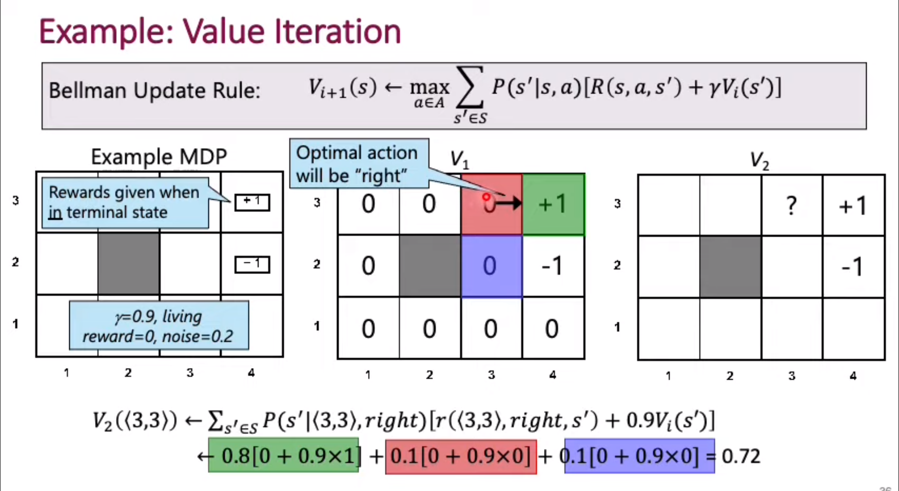
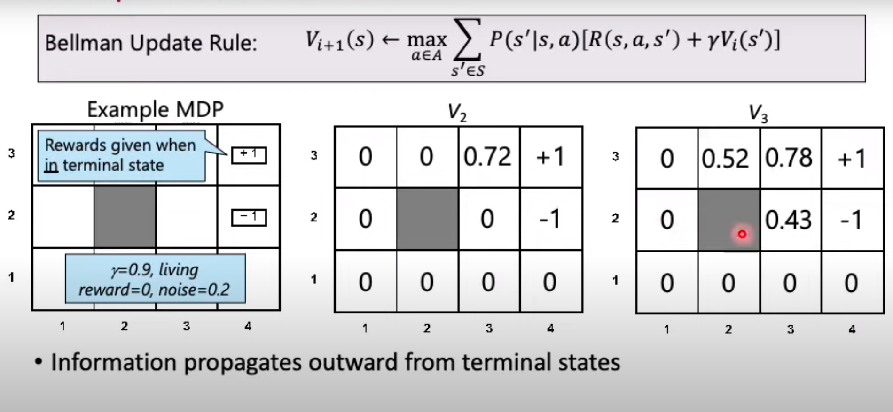

# 1. The diffrence between the State value function  and the total  Rewards :

##  The total rewards R:
It is the total sum of rewards starting from the current state assuming it is $$S_{0}$$
 $$R_{total} = \sum_{t=0}^{\infty} {\gamma^t r_{t}} $$ 
$$\gamma: \space is \space  \space the  \space  discount \space  rate \space  $$

    The most crucial thing to note is that this formula is valid only for deterministic models where the applying the same action to the same state will always result in a one single new state

## The Q value :
    It is the same as Reward but the difference is that it is used for non deterministic models so applying the same action to the same state may result in many diffrent states based on some probability distribution.

So we consider the Expected value of R instead of a single value as follows

$$Q(S,a)=E[R_{total}|S_{0}=S,a_{0}=a,\pi]$$
where
$$\pi : the \space  agent \space  policy$$

# 2. The belleman equation :
    The basic idea about it is the value of a state is computed when taking an action and it's only dependent on the immediate reward and the value of the next state  as in the formula:

$$V_{\pi}(S_{t})=r(S_{t},a_{\pi,t})+ \gamma V_{\pi}(s_{t+1})$$

    The most intresting point is that this equation is equivalent to the equation of the value decribed above but it's the recursive definition version 

# 3 . The belleman optimality principle( backward induction):

    The idea is that for optimal policy at a given state we care only about the next state . meaning the optimal behaviour is independentt of the past states
    
So in other words to get the best policy for the current state we need to start from the state we want to achive that is $$S_{t}^*$$

And hence the optimal policy will be the policy that chooses the action a such that 

$$ V^\*(S_{t-1})=max_{a}\{ r(S_{t-1},a)+ \gamma V^\*(S_{t})\}$$

And hence by the recursive defintion we move backward to the current state

# 4. Model Free and model based algorithms:

# Model based :

## Actor critic (MDP):

1. **Def**: 
    Here the model has some predifined assumptions abt the envirmnemt and it's modeled an an MDP
2. **Compoenents**: 
    A set of states.  A set of actions for each state. Transition model: $$T(S_{t},a_{t},S_{t+1})$$ that denotes the probality distiribution of the next.  

    Reward function: That is the reward recived `during` the transition $$r(S_{t},a_{t},S_{t+1})$$
     
 
### Value iteration and Policy iteration in model based algorithms: 

    There are two ways to find the optimal policy using the recusive policy of the belleman recusive definition

### The Value iteration method :

    We intiate all state values with zero or using random values 
1 . $$\forall s \in S  V(s)=0$$

2. We iterate until $$V_{i}(s)\space converges \space to \space V^\*(s) \space \forall s \in S \space \forall i > t \space  where \space t \space denotes \space  the  \space time \space  of \space  convergence$$

The forumala (The Update rule for a fixed state accross one iteration to the next ) can be written as follows:

$$V_{i+1}(s)= \max_{a \in \space Actions(s)}( \sum_{s\` \in PossibleStates(s) }T(s,a,s\`)(r(s,a,s\`)+ \gamma V_{i}(s))$$

2. A basic example:

    1. A space with 3 *4 number of states  
    2. All values starting with zeros  
    3. The final states are initialized first  
    4. Consider updating the value for the state (3,3) 
    5. We have 3 possible actions down,left ,right 
    6. If the action is right then a probability of 0.8 the action is right <nr>
    7. Otherwise we unfiromaly distribute the 0.2 probabilty for the remaining actions (here 0.1 each ) 

    8. so for a fixed action (right ) we get the following value for the state (3,3) that is 0.72 

    9. Note that the value function for the resulting states are all equal to zero except the case of succesfully applying the right action to fall in a terminatio  state with value equal to 1

    9. we do the same thing for the left and down actions 

    10. In this  case it is clear that the right action is the best fot the state (3,3) 

After some iterations here are the updated values  

    As u can notice as if we are starting from the terminal states a propagating the state values after.
    And finally the optimal policy is the policy that always select the action that leads to the optimal value function for any given state.

#### Policy evaluation method:

   We intiate all state values with zero or using random values  
1 . $$\forall s\in S : V_{\pi}(s)=0$$

2. The update rule: $$V_{i=1}^{\pi} (S)= \sum_{ s\` \in PossibleStates(S)}T(S,\pi(S),s\`)\space (R(\space S,\pi(S),s\` \space)+ \gamma V^{\pi}_{i}(s\`))$$

    As u can see there no maximization here and we just compute the evaluation of a state in a naive way based on the action given by the policy 

3. The algorithm :
Repeat until convergence  

$$ \forall \pi^k \in \prod do :$$

Iterate simplified belleman update until values converges for all states given that fixed.  $$\pi^k  \space as \space follows:$$

$$V_{i+1}^{\pi_{k}}(s) \leftarrow \sum_{s\`}P(s\`|s,\pi_{k}(s))\space (\space R(s,\pi_{k}(s),s\`) + \space \gamma V_{i}^{\pi_{k}}(s\`))$$

After the values convergence we update the fixed policy as given in this formula

$$ \pi_{k+1}(s)= argmax_{a}\sum_{s\`}P(s\`|s,\pi_{k}(s))\space (\space R(s,\pi_{k}(s),s\`) + \space \gamma V_{i}^{\pi_{k}}(s\`))$$

    Here in other words the new policy will learn from the progess of the current policy values computation.

####  Summary:
    
    So u can say that value iteration  is independent of the policy as it select the maximum value from the first place .while the policy iteration is highly dependant on the policy chosen as it does not select the real max values but the the max values calculated by that policy.
    The policy iteration with one iteration will result in the value iteration 

